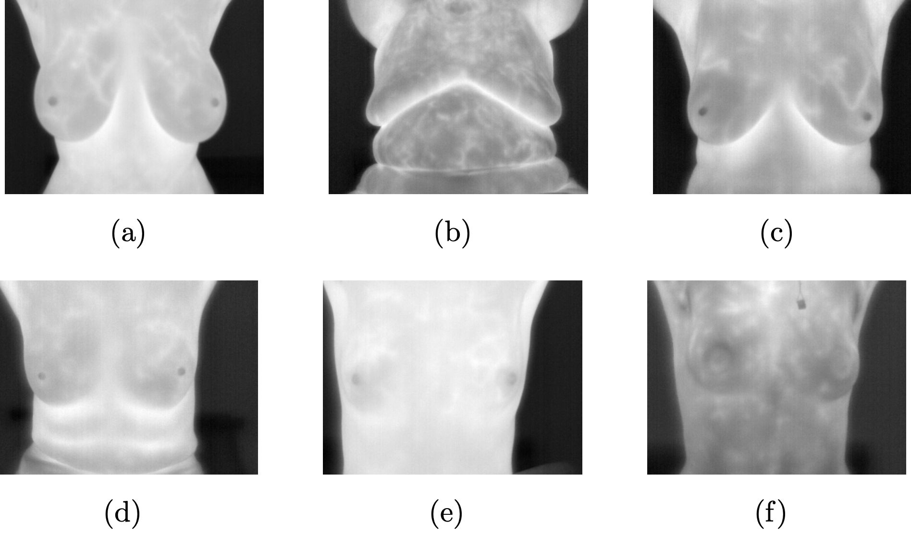

# Automatic Nipple Detection in Breast Thermograms

This repository contains a MATLAB implementation of a method for automatically detecting nipples in breast thermograms. The method follows the approach described in the paper by Abdel-Nasser et al. (2016) for nipple detection using image segmentation, adaptive thresholding, and a new selection algorithm. The algorithm processes a thermogram image and returns the input image with the detected nipple positions marked.

## Objective

The main goal of the project is to develop a MATLAB function that:

1. Segments the human body in a thermogram image.
2. Determines candidate nipple locations using an adaptive threshold.
3. Detects the nipples using a selection algorithm based on a roundness measure.

### Input:
- A thermogram image (grayscale).

  

### Output:
- The input image with positions of detected nipples marked.

  

